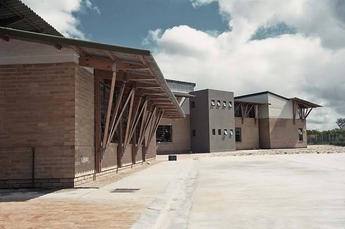
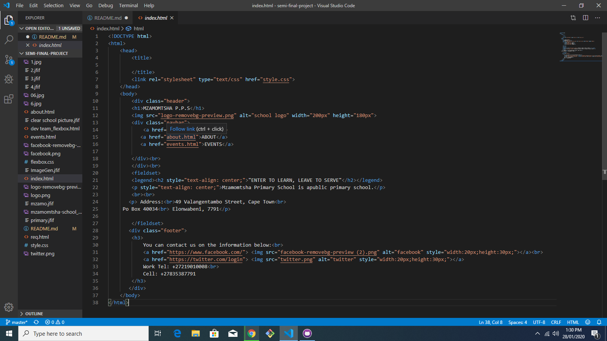

# Mzamomtsha Primary School Website

==============================

Description: 
This website can help you find information about the school, the address of the school and upcoming events.
======================================================

Installation Instructions:<b>

=============================

Short Example/Tutorial: 
Step 1: Open Visual Studio Code 
Step 2: Write Some HTML, CSS & Javascript codes 
Step 3: Save all the Pages. 
Step 4: View the HTML Pages in Your Browser.
===========================================

Issue tracker: 
https://github.com/Mbu007/semi-final-project
============================================

Documentation of all code:

================================

Comments: 
You can add comments to your code by using the following syntax: 
HTML :
<.!-- Write your comments here --> 
CSS :
// - For single comment 
/* */ - For multiple comments
=============================

Citation: 
Author: Challengers 
Title: Mzamomtsha P.P.S 
Publisher:  
Location of Publication: CapaCiti CPT 
Date of Publication: --Jan 2020 
Date accessed/ retrieved: ----2020 
URL : https://github.com/Mbu007/semi-final-project 
Estimated length: 38 insertions
===============================

Licensing: 
This website was licenced by CapaCiti
=====================================

Publisher: 
The Challengers Soft. Dev's
===========================

Our e-mail link: 
mbuvoyi@gmail.com
;======================================